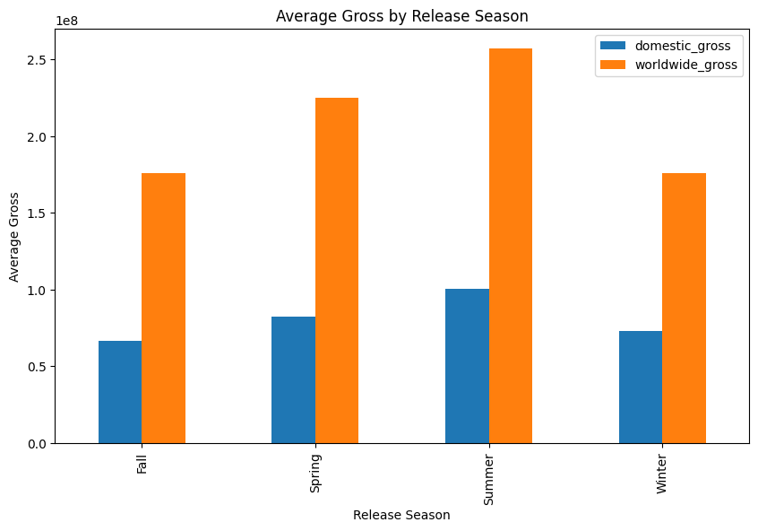

# Microsoft Movie Studio Project

## Overview

This project aims to assist Microsoft in establishing its new movie studio by exploring trends in the movie industry to make informed decisions. The business problem is to determine what types of films are currently performing best at the box office. The analysis is conducted using a dataset containing information on movie genres, production budgets, release dates, runtime, cast, directors, and box office gross earnings.

## Data

The dataset used in this project contains comprehensive information about various movies, including their genres, production budgets, release dates, runtime, cast, directors, and box office earnings (domestic and worldwide). The data was collected over the last decade and provides a wide range of variables to analyze and extract insights.

## Methods

The analysis involves data exploration, visualization, and statistical analysis. The primary questions considered are:

1. What genres are currently the most profitable?
2. How does the budget of a movie relate to its box office performance?
3. How does the time of release influence a movie's success?
4. What are the trends in movie runtime and their impact on box office returns?
5. What impact does the cast and director have on a movie's success?

## Results

Based on the analysis, several actionable insights have been uncovered:

1. **Top 5 Most Profitable Genres:** Action, Adventure, Sci-Fi, and Adventure, Animation, Comedy are the most profitable genres in the last decade, generating substantial box office earnings.

Top 5 most profitable genres in the last 10 years:

| Genres                        | Profit               |
|-------------------------------|----------------------|
| Action, Adventure, Sci-Fi     | $7,408,407,000,000.00 |
| Adventure, Animation, Comedy  | $6,141,670,000,000.00 |
| Action, Adventure, Fantasy    | $2,541,036,000,000.00 |
| Action, Adventure, Comedy     | $2,504,744,000,000.00 |
| Action, Crime, Thriller       | $1,286,476,000,000.00 |

Genres with the highest average profitability:

| Genres                         | Average Profit      |
|--------------------------------|---------------------|
| Adventure, Drama, Sport        | $1,122,500,000.00   |
| Fantasy, Romance               | $1,122,500,000.00   |
| Biography, Documentary, History| $679,200,000.00     |
| Family                         | $679,200,000.00     |
| Documentary, Drama, Sport      | $671,100,000.00     |

2. **Budget and Box Office Performance:** A strong positive correlation exists between the production budget and both domestic and worldwide box office earnings. Higher production budgets tend to result in higher box office returns.

.png)

3. **Release Timing:** Movies released during the Summer and Spring seasons tend to have the highest average gross earnings, making strategic release timing critical for success.

4. **Runtime Impact:** Movies with longer runtimes, especially in the (150, 180] minutes interval, tend to achieve higher average domestic and worldwide gross earnings.

5. **Talent Influence:** Collaborating with recognizable and successful actors, directors, and crew members can enhance a movie's appeal and contribute to higher box office earnings.

| primary_name          | domestic_gross | worldwide_gross |
|-----------------------|----------------|-----------------|
| Joe Robert Cole       | $700,100,000.0 | $1,348,300,000.0 |
| Judy Greer            | $652,300,000.0 | $1,648,900,000.0 |
| Ty Simpkins           | $652,300,000.0 | $1,648,900,000.0 |
| Craig T. Nelson       | $608,600,000.0 | $1,242,500,000.0 |
| Erik Smitt            | $608,600,000.0 | $1,242,500,000.0 |
| Huck Milner           | $608,600,000.0 | $1,242,500,000.0 |
| John Walker           | $608,600,000.0 | $1,242,500,000.0 |
| Mahyar Abousaeedi     | $608,600,000.0 | $1,242,500,000.0 |
| Nicole Paradis Grindle| $608,600,000.0 | $1,242,500,000.0 |
| Sarah Vowell          | $608,600,000.0 | $1,242,500,000.0 |

## Recommendations

Based on the findings, the following recommendations are proposed for Microsoft's new movie studio:

1. **Invest in Profitable Genres:** Focus on producing action, adventure, sci-fi, and adventure, animation, comedy movies to increase the chances of financial success.

2. **Allocate Adequate Budget:** Ensure that movies receive sufficient production budget to maintain high quality, marketing efforts, and talent acquisition.

3. **Strategically Time Releases:** Plan movie releases during the Summer and Spring seasons for the best chance of achieving high box office earnings.

4. **Explore Longer Runtimes:** Consider producing movies with runtimes in the (150, 180] minutes interval to potentially increase average gross earnings.

5. **Attract Recognizable Talent:** Collaborate with well-known actors, directors, and crew members to enhance the appeal of movies and attract audiences.

By incorporating these insights and recommendations, Microsoft's new movie studio can position itself for success in the competitive movie industry and create engaging and financially successful films.